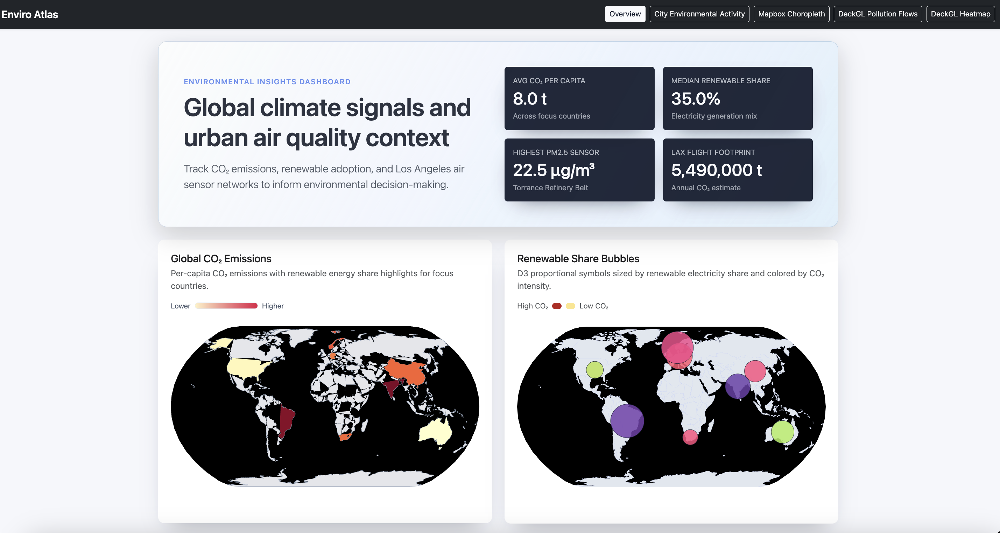
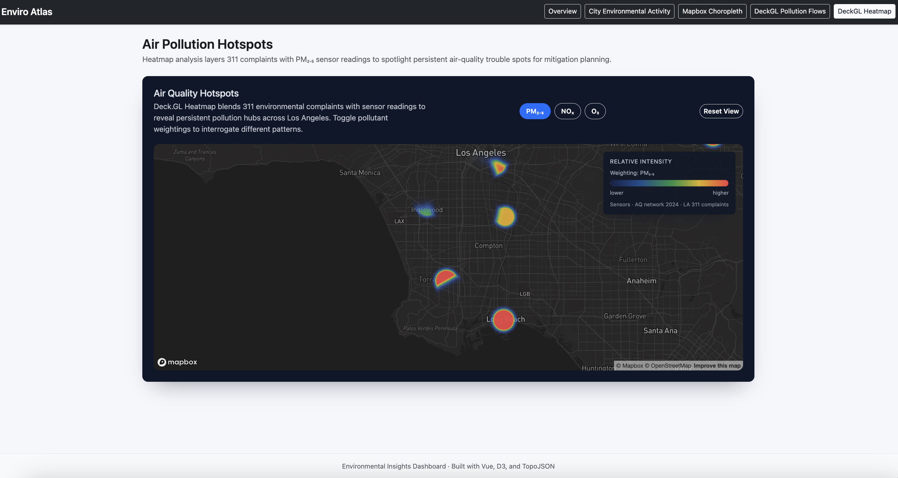
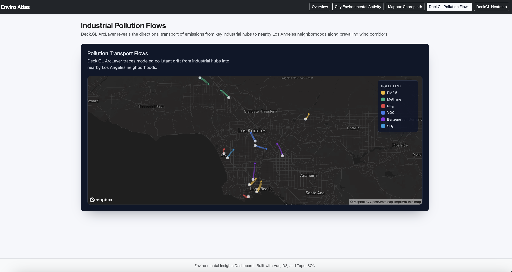

# Spatial Decision Intelligence Dashboard

### 🚀 Project Overview
**Role:** Product Designer & Full-Stack Developer
**Tech Stack:** Vue.js, D3.js, Deck.GL, Mapbox GL, Python (Data Processing)

This project is a high-performance **Geospatial Analytics Platform** designed to visualize complex multi-dimensional data for operational decision-making.

While originally built to track environmental risk factors (Air Quality, Industrial Emissions), the underlying architecture demonstrates the core capabilities required for **Commercial Business Intelligence**:
* **Real-time Anomaly Detection:** Identifying "Hotspots" (relevant for Fraud/Risk Control).
* **Flow Analysis:** Visualizing supply chain or user traffic patterns.
* **Macro-to-Micro Drill Down:** Moving from global KPIs to neighborhood-level granularity.

---

### 📺 System Modules & Visualization Logic

#### 1. Global Command Center (Macro View)
A unified view of key performance indicators (KPIs) integrating disparate data sources.
* **Tech:** D3.js Proportional Symbol Maps.
* **Product Value:** Provides executives with an instant "Health Check" of global operations before drilling down.


#### 2. Risk Hotspot Analysis (Deep Dive)
Interactive heatmap using WebGL to handle large-scale sensor datasets without performance loss.
* **Tech:** Deck.GL Aggregation Layers.
* **Use Case:** Identifies high-risk clusters (e.g., pollution spikes in this demo, or fraud rings in a fintech context) to prioritize resource allocation.


#### 3. Network Flow & Transport (Logistics)
Visualizes directional relationships and transport volume between nodes.
* **Tech:** Deck.GL Arc Layers.
* **Use Case:** Tracing the source of issues (e.g., pollution sources) or mapping user user journey flows across physical locations.


---

### 🛠️ Technical Architecture
* **Frontend:** Vue.js for component-based UI architecture.
* **Visualization Engine:** A hybrid approach using **D3.js** for SVG interactions and **Deck.GL/Mapbox** for WebGL-accelerated map rendering.
* **Data Pipeline:** Python scripts to clean, normalize, and structure raw sensor data into GeoJSON formats optimized for web rendering.

### Features

- **World Maps**: D3 choropleth map for CO2 emissions and proportional bubble map for renewable energy data
- **City Maps**: 
  - D3 dot map for environmental complaints
  - Vega-Embed choropleth map for neighborhood data
  - Mapbox interactive neighborhood choropleth
- **Advanced Visualizations**: 
  - Mapbox + DeckGL arc layer for flight flow patterns
  - Mapbox + DeckGL heatmap for PM2.5 air quality data
- **Interactive UI**: Multi-page Vue app with Bootstrap responsive layout

## Technologies

- **Frontend**: Vue 3, Vite
- **Mapping**: D3.js, Vega-Embed, Mapbox GL, DeckGL
- **Data Format**: GeoJSON, CSV, JSON

## Getting Started

### Installation

```bash
npm install
```

### Running the Development Server

```bash
npm run dev
```

The dashboard will be available at `http://localhost:5173`

### Building for Production

```bash
npm run build
```

## Project Structure

```
src/
├── components/       # Vue map components
├── pages/           # Dashboard pages
├── data/            # GeoJSON, CSV, and JSON data files
└── App.vue          # Main application component
```

## Data Sources

- Air quality data from LA environmental sensors
- Flight flow data from LAX
- Renewable energy indicators from country-level datasets
- Neighborhood boundaries from LA Times

## Navigation

The dashboard includes 5 main pages accessible via navigation:

1. **Overview** - Global environmental statistics
2. **City Environmental Data** - LA-specific environmental metrics
3. **City Air Hotspots** - Detailed air quality visualization
4. **City Deck Flows** - Flight and pollution flow patterns
5. **Neighborhood Choropleth** - Detailed neighborhood-level data

---

### 💡 Product Roadmap (Future Iterations)
* **AIGC Insight Integration:** Connecting the backend to an LLM agent that automatically generates text summaries of "Hotspot" events (e.g., *"Warning: Abnormal spike detected in Sector 7 linked to Industrial Node B"*).
* **Predictive Layer:** Adding a time-series forecasting module to predict future spread based on historical flow data.
